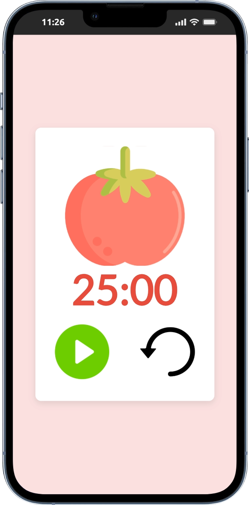

# Pomodoro Timer

## Descrição

Este projeto é uma implementação de um **Timer Pomodoro**, baseado na técnica de produtividade Pomodoro. O timer conta 25 minutos de foco e 5 minutos de descanso, com botões de controle de **Play**, **Pause** e **Reset**.

O aplicativo possui uma interface simples e elegante, ideal para quem quer melhorar sua produtividade.

---

## Funcionalidades

- **Timer Pomodoro**: Um contador que alterna entre 25 minutos de foco e 5 minutos de descanso.
- **Notificação**: Quando o timer atinge 0, um som de notificação é tocado.
- **Controle de tempo**: Os botões de Play, Pause e Reset permitem controlar o fluxo do timer.
- **Design responsivo**: A interface se adapta tanto para dispositivos móveis quanto para desktop.

---

## Como Rodar o Projeto Localmente

### Pré-requisitos

Para rodar o projeto, você precisa ter o **Node.js** e o **npm** instalados na sua máquina.

1. **Instale o Node.js**: [Baixe aqui](https://nodejs.org/)
2. **Verifique a instalação**:

   ```bash
   node -v
   npm -v
   ```

### Passos para Rodar

1. Clone o repositório:

   ```bash
   git clone https://github.com/Dirlandia404/pomodoro.git
   cd pomodoro
   ```

2. Instale as dependências do projeto:

   ```bash
   npm install
   ```

3. Inicie o servidor de desenvolvimento:

   ```bash
   npm start
   ```

4. Abra o navegador e acesse `http://localhost:3000` para ver o aplicativo em funcionamento.

---

## Estrutura do Projeto

- **src**: Contém os arquivos de código-fonte React.
  - **App.js**: Componente principal do aplicativo, onde a lógica do Pomodoro e os botões de controle são implementados.
  - **Clock.js**: Componente que exibe o timer e a interação com os botões de controle.

- **public**: Contém o arquivo `index.html` e ícones usados no projeto.
- **package.json**: Contém as dependências do projeto e scripts de execução.

---

## Tecnologias Usadas

- **React**: Biblioteca JavaScript para construir interfaces de usuário.
- **Node.js**: Ambiente de execução para JavaScript no backend.
- **CSS**: Estilização do layout do aplicativo.
- **Vercel** (opcional): Plataforma de deploy para hosting do projeto.

---

## Contribuindo

1. Faça um fork deste repositório.
2. Crie uma branch para a sua feature (`git checkout -b feature/feature-name`).
3. Faça commit das suas alterações (`git commit -am 'Adicionando nova feature'`).
4. Faça push para a branch (`git push origin feature/feature-name`).
5. Abra um pull request.

---

## Licença

Distribuído sob a licença MIT. Veja o arquivo [LICENSE](LICENSE) para mais detalhes.

---

## Demonstração

Aqui está uma captura de tela do projeto:


